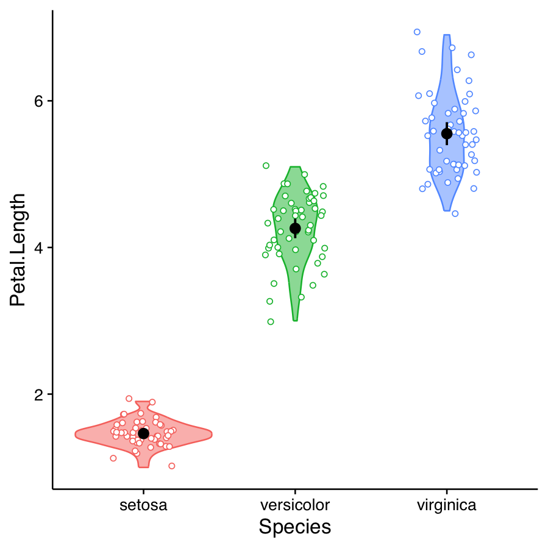
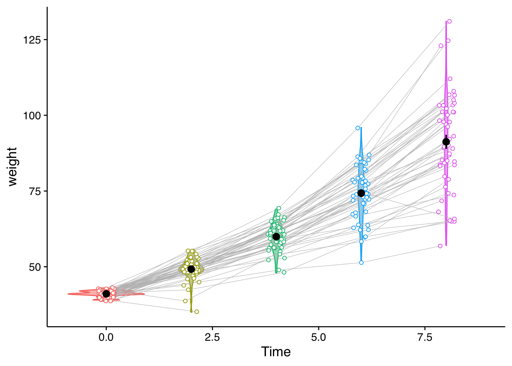

# dal_utils_r

A collection of R utility functions for data wrangling, analysis and visualization.

## Usage

Clone the repository and source the loader script:

```r
source("load_all.R")
```  
Although individual functions can be accessed in their .R files, please mind that they often use other helper functions. Most functions also rely on tidyverse packages, and visualization functions also rely on some predefined graphic parameters. These can be found in `globals.R`, which is automatically loaded by the loader script.

## Function Index
- `create_cor_anot()` — compute correlations across variable pairs and return r, p, and annotation strings.
- `create_significance_label()` — convert p-values to significance stars (***, **, *, ., n.s.) commonly used in statistical reporting.
- `create_violin()` — custom violin plots with individual dots, error bars, and optional longitudinal connections.
- `summarise_with_ci()` — summarise a variable with mean, sd, se, and 95% CI.

## Examples

### `create_cor_anot()`
Compute pairwise correlations between variables, with optional grouping. Returns coefficients, p-values, and significance annotations in a tidy format.

#### Example (iris dataset)

```r
create_cor_anot(
  iris, 
  vars = c("Sepal.Length", "Sepal.Width", "Petal.Length"),
  group_var = "Species")
``` 
```
# A tibble: 9 × 5
  Species    pair                          r     p anot          
  <fct>      <chr>                     <dbl> <dbl> <chr>         
1 setosa     Sepal.Length_Sepal.Width   0.74  0    r = 0.74, *** 
2 setosa     Sepal.Length_Petal.Length  0.27  0.06 r = 0.27, .   
3 setosa     Sepal.Width_Petal.Length   0.18  0.22 r = 0.18, n.s.
4 versicolor Sepal.Length_Sepal.Width   0.53  0    r = 0.53, *** 
5 versicolor Sepal.Length_Petal.Length  0.75  0    r = 0.75, *** 
6 versicolor Sepal.Width_Petal.Length   0.56  0    r = 0.56, *** 
7 virginica  Sepal.Length_Sepal.Width   0.46  0    r = 0.46, *** 
8 virginica  Sepal.Length_Petal.Length  0.86  0    r = 0.86, *** 
9 virginica  Sepal.Width_Petal.Length   0.4   0    r = 0.40, ** 
```

### `create_significance_label()`
Pass a column with p-values within a tidy dataframe to add another column with the significance Labels commonly used for simplified statistical reporting (`"***"`, `"**"`, `"*"`, `"."`, `"n.s."`).

#### Example (custom dataset)

```r
df <- tibble(p = c(0.0005, 0.02, 0.07, 0.3))
df$signif <- create_significance_label(df$p)
df
``` 
```
# A tibble: 4 × 2
       p signif
   <dbl> <chr> 
1 0.0005 ***   
2 0.02   *     
3 0.07   .     
4 0.3    n.s. 
```

### `create_violin()`
Produce violin plots with overlied summary statistics. Individual points are jittered to avoid overlapping, and can be connected across violins if sharing the same ID.

#### Example 1: independent observations for each violin (iris dataset)

```r
create_violin(
  df = iris,
  variable_x = Species,
  variable_y = Petal.Length,
  error_type = "CI"
)
```  


#### Example 2: dependent observations connected with lines (ChickWeight dataset)

```r
create_violin(
  df = ChickWeight %>% filter(Time < 10),
  variable_x = Time,
  variable_y = weight,
  error_type = "SE",
  dep_obs = TRUE,
  variable_longit = Chick
)
```  



### `summarise_with_ci()`
Summarise a variable with mean, sd, se, and 95% CI.

#### Example (iris dataset)

```r
iris %>%
  group_by(Species) %>%
  summarise_with_ci(Petal.Length)
``` 
```
# A tibble: 3 × 7
  Species    sd_Petal.Length Petal.Length n_Petal.Length se_Petal.Length low_ci_Petal.Length up_ci_Petal.Length
  <fct>                <dbl>        <dbl>          <int>           <dbl>               <dbl>              <dbl>
1 setosa               0.174         1.46             50          0.0246                1.41               1.51
2 versicolor           0.470         4.26             50          0.0665                4.13               4.39
3 virginica            0.552         5.55             50          0.0780                5.40               5.71
```